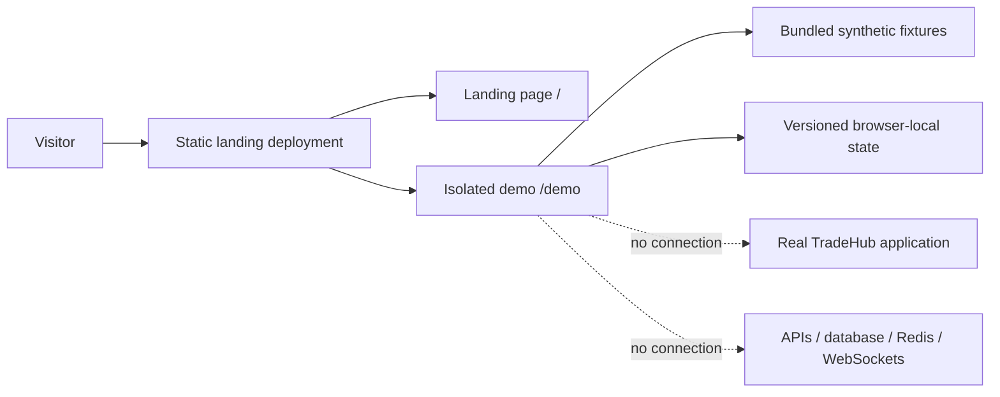

# Isolated TradeHub Demo Architecture

## Ownership boundary

The public demo is owned entirely by the landing-page repository. The real TradeHub repository was used only as a visual and product-behavior reference. It is not imported, embedded, contacted, built, or deployed by the demo.

The landing page and demo compile into one Astro static build. Deployment requires one artifact, one host, and history-free navigation because the interactive views use buttons and a URL hash within `/demo`.

## Isolation

- Synthetic market fixtures are bundled from `src/demo/data.ts`.
- Mutable state uses the versioned key `tradehub:isolated-demo:v2`.
- Stored fields are limited to a random demo-session identifier, virtual cash, synthetic holdings, virtual transactions, fixture IDs, fictional demo posts, reactions, and followed fictional profiles.
- There is no API client, authentication, cookie, form submission, upload, socket, worker, database, Redis, analytics, tracking, or market-provider integration.
- If storage is unavailable, the experience continues in memory until the page is closed.
- Reset replaces the entire mutable state with the reviewed seed and issues a fresh anonymous session identifier.

## Included experience

- Dashboard and market overview.
- Searchable market board and company detail.
- Virtual buy and sell with balance and holding checks.
- Portfolio, transactions, and watchlist.
- Fictional community feed with topic filters, browser-local posting, reactions, and follow controls.
- Fictional demo profile and isolation explanation.
- Persistent Demo environment state, market-data disclaimer, reset, and landing-page return.
- Desktop sidebar and mobile bottom navigation.
- Optional session-only guided tour through real demo controls and validated local
  outcomes.

Real comments, direct messages, notifications, uploads, authentication, live market data, and real-money behavior are excluded. Comment counts are illustrative; every social interaction is simulated locally.

## Source map

- `src/pages/demo.astro` — semantic demo shell and server-rendered initial dashboard.
- `src/demo/data.ts` — types, synthetic fixtures, and reset seed.
- `src/scripts/demo.ts` — isolated navigation, local state, trades, search, watchlist, persistence, and reset.
- `src/styles/demo.css` — scoped responsive product styling.
- `src/demo/tour.ts` — typed step configuration and state-machine transitions.
- `src/scripts/tour.ts` — session persistence, coachmarks, target resolution, and demo
  event coordination.
- `src/styles/tour.css` — accessible desktop coachmarks and mobile bottom sheets.

## Deployment

Run the normal landing-page production build and deploy its `dist/` directory. The resulting artifact contains both `/` and `/demo`; no TradeHub application deployment or runtime environment variable is required.
