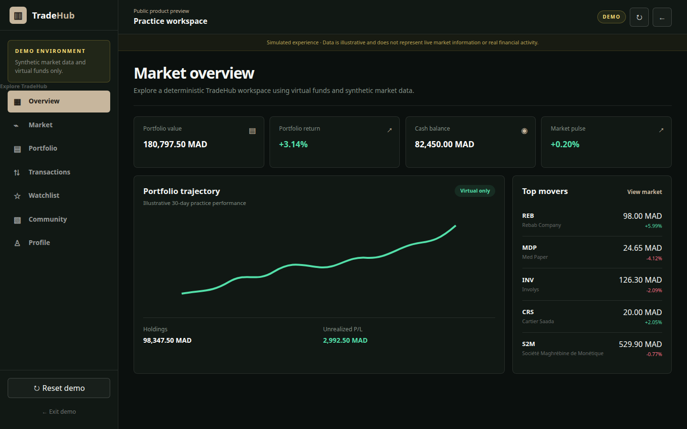
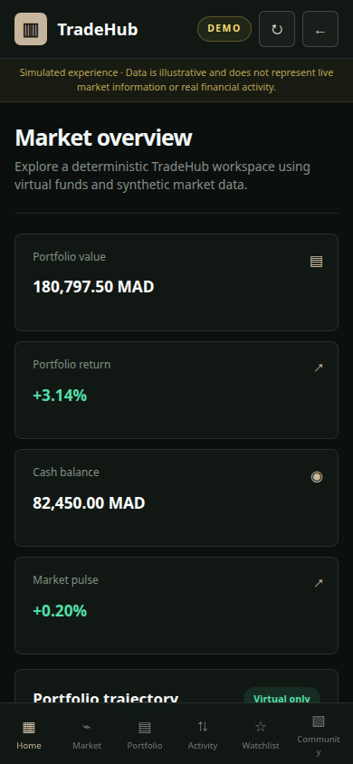
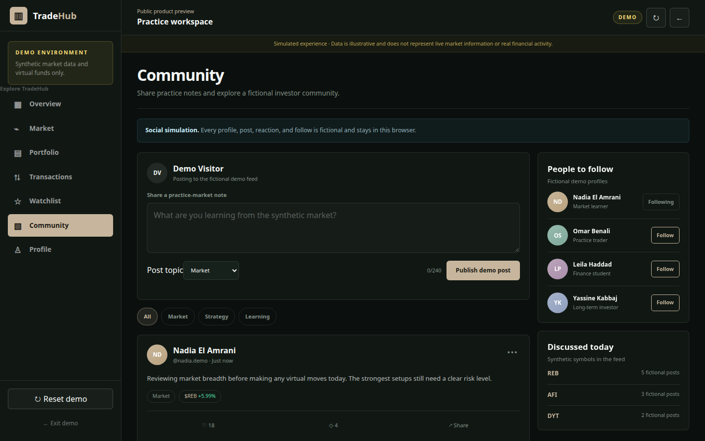
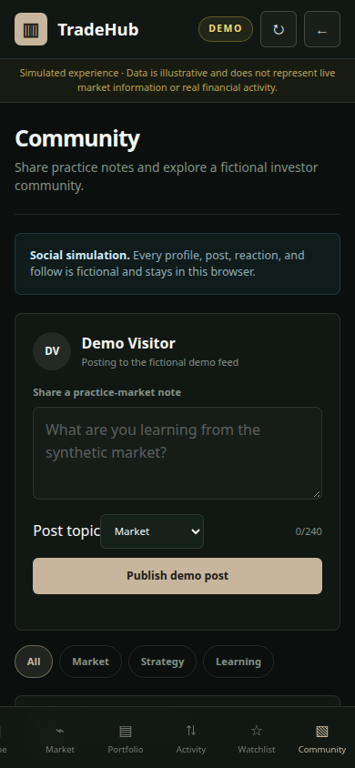

# Task 008 Completion Report — Isolated Public Demo

## Outcome

Replaced the temporary `/demo` handoff with a self-contained interactive TradeHub simulation inside the landing-page repository. The user clarified that the real TradeHub repository was reference material only, so the earlier implementation there was removed completely and its worktree was restored to clean.

## Repository boundary

- Demo owner: `/home/akajjou/Desktop/TradeHub-landing-Page`
- Reference application: `/home/akajjou/Desktop/TradeHub`
- The reference application has no demo source changes and no demo container.
- The landing site and demo deploy as one static Astro artifact.

## Implemented scope

- Immediate `/demo` entry without registration.
- Synthetic overview, market, company detail, portfolio, transactions, and watchlist.
- Virtual buy and sell with deterministic fixture prices.
- Browser-local persistence and deterministic reset.
- Interactive fictional community feed and fictional profile.
- Browser-local post creation, topic filters, reactions, and fictional-profile follows.
- Visible Demo environment labels and non-live-data disclaimer.
- Desktop and mobile navigation, landing-page exit, skip link, and focus styles.
- No production or real-application network path.

## Isolation evidence

Browser automation loaded and navigated the demo at 320, 390, 768, and 1440 pixels. It observed zero requests outside the landing-page origin, zero console errors, zero page errors, and zero horizontal page overflow.

A two-share virtual purchase changed transaction count from 4 to 5 and virtual cash from 82,450 to 82,410 MAD. The state survived reload. Reset restored transaction count to 4 and cash to 82,450 MAD.

The community extension publishes visitor-authored demo notes locally, filters the feed by topic, toggles reactions and fictional-profile follows, persists those changes on reload, and removes them on reset. It does not submit or transmit content.

## Validation

- Formatting: passed after repository Prettier formatting.
- ESLint: passed with zero warnings.
- Astro and strict TypeScript: passed with zero diagnostics.
- Production build: passed; `/` and `/demo` generated.
- Responsive browser checks: passed at 320×720, 390×844, 768×1024, and 1440×900.
- Keyboard skip-link focus: passed at all checked widths.
- External/API/WebSocket requests: none.
- Persistence and reset: passed.
- Real TradeHub worktree: clean after removal of the superseded implementation.

## Files

- `src/pages/demo.astro`
- `src/demo/data.ts`
- `src/scripts/demo.ts`
- `src/styles/demo.css`
- `src/content/site.ts`
- `README.md`
- `docs/PROJECT_BRIEF.md`
- `docs/CONTENT.md`
- `docs/DESIGN_SYSTEM.md`
- `docs/IMPLEMENTATION_PLAN.md`
- `docs/ISOLATED_DEMO_ARCHITECTURE.md`
- `docs/TASK_008_COMPLETION_REPORT.md`
- `docs/screenshots/task-008/isolated-demo-desktop.png`
- `docs/screenshots/task-008/isolated-demo-mobile.png`
- `docs/screenshots/task-008/community-demo-desktop.png`
- `docs/screenshots/task-008/community-demo-mobile.png`

## Screenshots

### Desktop — 1440×900

### Mobile — 390×844

### Community desktop — 1440×900

### Community mobile — 390×844

