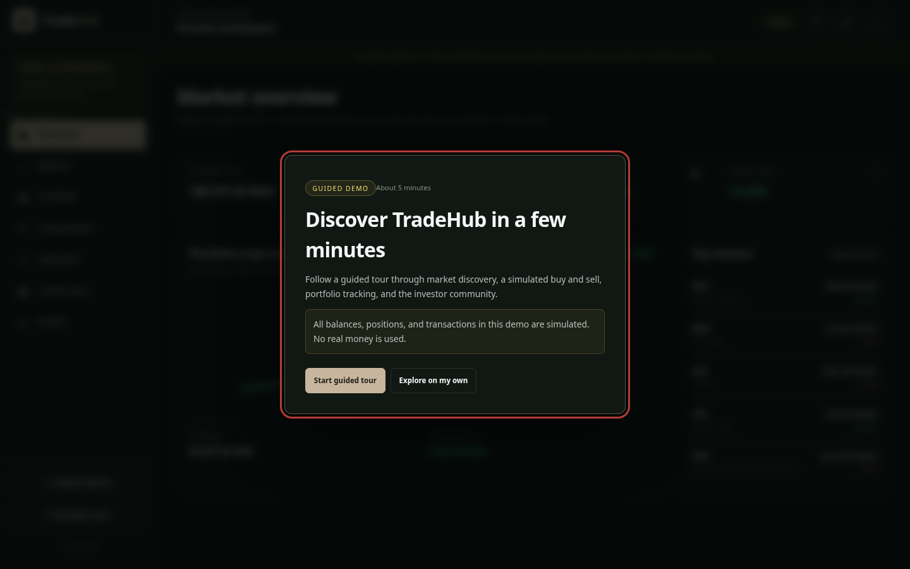
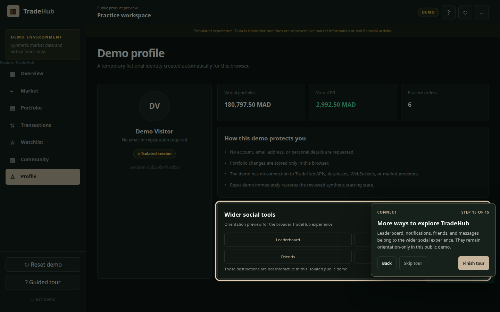
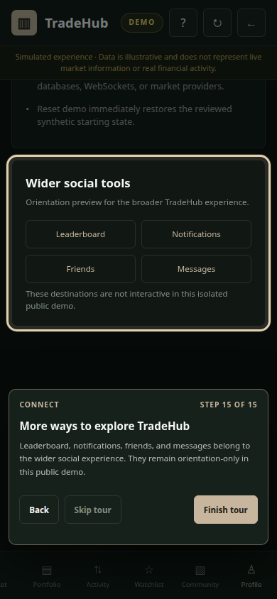
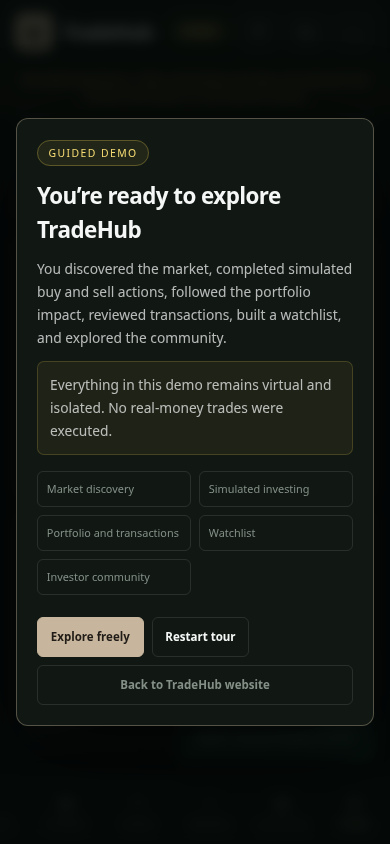

# Guided Interactive Demo Tour — Completion Report

## Outcome

Implemented an optional 15-step guided product tour inside the completed isolated
TradeHub demo. It teaches Discover, Practice, Understand, and Connect through actual
demo controls and validated browser-local results. Free exploration remains available
at entry, during the tour, and after completion.

## Actual route and component mapping

The static demo remains one `/demo` route. Its internal views use the existing hashes
`#market`, `#stock`, `#portfolio`, `#transactions`, `#watchlist`, `#community`, and
`#profile`. `src/pages/demo.astro` owns semantic surfaces and stable targets;
`src/scripts/demo.ts` owns navigation and mutations; `src/scripts/tour.ts` owns tour UI,
session persistence, target resolution, focus, and event coordination;
`src/demo/tour.ts` owns typed configuration and transitions.

## Final step list and copy

1. **Welcome — Discover TradeHub in a few minutes.** Follow a guided tour through
   market discovery, a simulated buy and sell, portfolio tracking, and the investor
   community.
2. **Your investing overview.** This dashboard brings together simulated balance,
   portfolio value, market movement, and activity.
3. **Start with the market.** Activate the real Market navigation.
4. **Find a company.** Search for DYT and open its synthetic market result.
5. **Understand the market context.** Review illustrative price history and indicators;
   the feed is not live.
6. **Save it to your watchlist.** Use the real DYT watchlist control.
7. **Practice a buy decision.** Choose the real virtual Buy flow.
8. **Complete the simulated order.** Enter 10 and confirm the virtual purchase.
9. **See the portfolio impact.** Open the real Portfolio view.
10. **A connected portfolio view.** Inspect the resulting DYT position and totals.
11. **Keep a clear activity history.** Open Transactions and verify the created DYT buy.
12. **Practice a partial sell.** Open DYT from Portfolio, choose Sell, enter 5, and
    confirm the real virtual sale.
13. **Keep important instruments close.** Verify DYT in Watchlist.
14. **Learn and connect through community.** React locally to a safe synthetic post.
15. **More ways to explore TradeHub.** Review orientation-only leaderboard,
    notifications, friends, messages, and the demo profile.

Completion explains that all activity remains virtual and isolated, then offers free
exploration, restart, or the landing-page return.

## Seed and completion state

The centralized configuration selects DYT at 355.05 MAD, buys 10 shares, and sells 5.
The seed has enough cash. Browser E2E verified that the final state contains a
five-share DYT holding, one 10-share buy, one 5-share sell, DYT in the watchlist, and a
reaction to `social-1`.

## State machine, events, and targets

The reducer models version, status, chapter, visitor step, internal substep, configured
instrument and quantities, transaction IDs, action completion, route expectation, and
recoverable error. Invalid or out-of-order events do not advance it. Domain-result
events are documented in `docs/GUIDED_DEMO_TOUR.md`; 22 stable target identifiers cover
the exact real controls used by the tour.

## Lifecycle behavior

- First entry requires explicit Start or Explore-on-my-own consent.
- Untouched state starts directly; changed state requires Reset and start.
- Cancel preserves changes; skip and Escape never reset.
- Restart invokes the existing `initialState()` reset through the demo controller.
- Completion preserves buy, sell, remaining position, watchlist, and reaction.
- `tradehub:guided-tour:v1` stores only non-personal session progress in
  `sessionStorage`, with an in-memory fallback.
- Refresh safely rewinds volatile search/quantity substates and resumes the expected
  real view.

## Accessibility and responsive decisions

Dialogs are labeled, described, focus-contained, and make the background inert.
Coachmarks visibly show chapter, progress, title, instruction, Back, Skip, and Next only
for informational steps. Action steps require the highlighted real control. Targets use
`aria-describedby`, visible focus/spotlight, and programmatic focus; a polite live
region announces changes. Escape pauses. Reduced motion disables animated movement.

At 320, 390, and 768 pixels, a bounded bottom sheet and temporary scroll clearance keep
the target visible above sticky navigation. Desktop uses clamped target-relative
placement. The full path had no document-level overflow at 320×568, 390×844, 768×1024,
1024×768, or 1440×900. A 200% zoom check retained 390-pixel document width and kept the
scrollable coachmark inside the viewport.

## Privacy, security, and isolation

No API, backend, production hostname, database, Redis, WebSocket, token, credential,
analytics, tracking, cookie, onboarding service, or personal-data field was added. The
tour renders fixed configuration through text nodes and uses the existing escaped
community renderer. Two independent browser contexts remained isolated. Every browser
run observed zero off-origin requests, console errors, and page errors. Real-money
execution remains unreachable.

## Bundle and performance

No dependency was added. The production tour JavaScript chunk is 17,699 bytes raw and
5,695 bytes gzip. The combined demo stylesheet is 22,705 bytes raw and 4,909 bytes
gzip; dedicated tour source CSS is 4,985 bytes raw and 1,451 bytes gzip. The tour module
is deferred and does not block server-rendered demo HTML. It uses event-driven
repositioning on step changes and resize, with no continuous polling or observer.

The production build generated both routes in 348 ms in the measured Docker run. The
tour introduced no network dependency, image, font, or runtime package.

## Files and dependencies

Added:

- `src/demo/tour.ts`
- `src/scripts/tour.ts`
- `src/styles/tour.css`
- `tests/tour.test.mjs`
- `docs/GUIDED_DEMO_TOUR.md`
- `docs/TASK_009_GUIDED_TOUR_COMPLETION_REPORT.md`
- `docs/screenshots/task-009/`

Modified for targets and result events:

- `src/pages/demo.astro`
- `src/scripts/demo.ts`
- `src/styles/demo.css`
- `package.json`
- `README.md`
- `docs/ISOLATED_DEMO_ARCHITECTURE.md`
- `docs/IMPLEMENTATION_PLAN.md`

No package or runtime dependency was added.

## Verification results

- Unit: typed transition happy path, invalid-event rejection, configured quantities,
  skip, error, and retry passed with `npm run test:tour`.
- E2E: complete 15-step path passed at all five required viewports.
- Domain outcomes: exact buy/sell quantities, remaining position, transaction rows,
  watchlist, and community reaction passed.
- Lifecycle: first-run choice, early skip, pause/resume, changed-state confirmation,
  cancel preservation, deterministic restart, refresh recovery, completion, and free
  exploration passed.
- Resilience: missing browser storage used in-memory state; reduced motion and 200% zoom
  remained usable.
- Isolation: two concurrent browser contexts did not share a probe or demo state.
- Quality: Prettier, ESLint with zero warnings, Astro/TypeScript with zero diagnostics,
  production build, Compose config/build, and `git diff --check` passed.
- Browser safety: no external requests, console errors, page errors, or horizontal page
  overflow.

Commands used for the completion gate:

```sh
npm run format:check
docker compose run --rm web npm run lint
docker compose run --rm web npm run check
docker compose run --rm web npm run test:tour
docker compose run --rm web npm run build
docker compose config --quiet
docker compose build
node /tmp/tradehub-tour-e2e.mjs
node /tmp/tradehub-tour-resilience.mjs
node /tmp/tradehub-tour-accessibility.mjs
git diff --check
git status --short
```

## Deviations and limitations

- The demo has no API, WebSocket, authentication, session expiry, or server-owned state,
  so API failure, WebSocket disconnect, authorization, and server-reset tests do not
  apply. Local target failure uses the specified recoverable error.
- Leaderboard, notifications, friends, and messaging are orientation-only because the
  isolated demo does not implement those destinations. The tour does not claim they are
  active.
- Commenting, saving posts, messages, friend requests, uploads, and public text creation
  are excluded from the critical tour. The safe action is a local reaction.
- No full screen-reader product was available. Semantic dialog, accessibility-tree,
  focus, keyboard, live-region, described-target, contrast-oriented visual, zoom, and
  reduced-motion checks were performed instead.
- No deployment or push was performed.

## Screenshots

### Desktop welcome — 1440×900



### Desktop guided step — 1440×900



### Mobile guided step — 390×844



### Mobile completion — 390×844



## Confidentiality and production boundary

The repository review found no secret, credential, private key, token, personal record,
production endpoint, or new external asset in the guided-tour changes. Existing earlier
task changes remain in the uncommitted working tree by user choice. The guided tour
does not contact or modify the separate TradeHub application, and production systems
and real-money behavior remain unreachable.

## Final working-tree status

The user is managing Git manually. No commit, reset, checkout, push, or deployment was
performed. The complete final short status is:

```text
 M README.md
 M docs/CONTENT.md
 M docs/DESIGN_SYSTEM.md
 M docs/IMPLEMENTATION_PLAN.md
 M docs/PROJECT_BRIEF.md
 M package.json
 M src/content/site.ts
 M src/pages/demo.astro
 M src/pages/index.astro
 M src/styles/global.css
 M src/styles/tokens.css
?? docs/GUIDED_DEMO_TOUR.md
?? docs/ISOLATED_DEMO_ARCHITECTURE.md
?? docs/TASK_007_COMPLETION_REPORT.md
?? docs/TASK_008_COMPLETION_REPORT.md
?? docs/TASK_009_GUIDED_TOUR_COMPLETION_REPORT.md
?? docs/screenshots/task-007/
?? docs/screenshots/task-008/
?? docs/screenshots/task-009/
?? src/demo/
?? src/scripts/
?? src/styles/demo.css
?? src/styles/tour.css
?? tests/
```

This includes the user-approved earlier Task 007 and isolated-demo work already present
in the working tree. The separate `/home/akajjou/Desktop/TradeHub` reference repository
has a clean short status.
